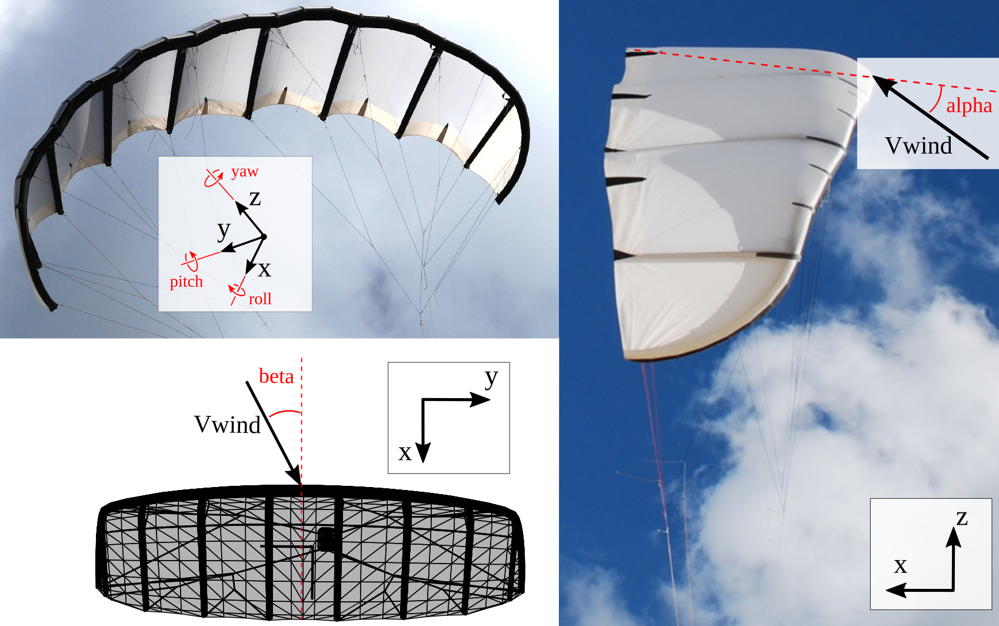

# Vortex Step Method
The Vortex Step Method (VSM) is an enhanced lifting line method that improves upon the classic approach by solving the circulation system at the three-quarter chord position. This adjustment allows for more accurate calculations of lift and drag forces, particularly addressing the shortcomings in induced drag prediction. VSM is further refined by coupling it with 2D viscous airfoil polars, making it well-suited for complex geometries, including low aspect ratio wings, as well as configurations with sweep, dihedral, and anhedral angles, typical for leading-edge inflatable (LEI) kites, that are used in airborne wind energy production, boat-towing and kite-surfing. 

A Julia version of this project is available at [VortexStepMethod.jl](https://github.com/Albatross-Kite-Transport/VortexStepMethod.jl)


## Reference Frame

The VSM uses a body-fixed reference frame with the following conventions:

**Coordinate Axes:**
- **x-axis**: Rearward (leading edge → trailing edge)
- **y-axis**: Right wing (when looking from behind the kite)
- **z-axis**: Upward (from wing tip to mid-span)

**Aerodynamic Angles:**
- **Angle of Attack (α)**: Positive for nose up
- **Sideslip (β)**: Positive for wind from the left/port side (positive Vy)

**Body Rotation Rates** (right-hand rule):
- **Roll rate (p)**: Positive for left wing down (counter-clockwise looking forward)
- **Pitch rate (q)**: Positive for nose up (clockwise looking from right wing)
- **Yaw rate (r)**: Positive for nose left (counter-clockwise looking down)

The reference frame is illustrated below for the open-source example kite, the [TU Delft V3 Kite](https://awegroup.github.io/TUDELFT_V3_KITE/).

<!--  -->


**Aircraft Frame Transformation:** For stability derivatives in standard aircraft coordinates (x-forward, y-right, z-down), use `map_derivatives_to_aircraft_frame()` from the `VSM.stability_derivatives` module. See `examples/TUDELFT_V3_KITE/evaluate_stability_derivatives.py` for usage.


## Key Features

- **Accurate low-aspect-ratio wing modeling** with enhanced lifting line theory
- **Viscous-inviscid coupling** using 2D airfoil polars (inviscid, CFD, ML-based)
- **Complex geometry support**: sweep, dihedral, anhedral, leading-edge inflatable (LEI) kites
- **Rigid-body stability derivatives**: automatic computation of dCx/dα, dCMy/dq, etc.
- **Trim angle solver**: automatic determination of trimmed angle of attack
- **Non-dimensional rate derivatives**: controls-friendly output (hat_p, hat_q, hat_r)
- **Reference point flexibility**: correctly handles moment reference point for rotational velocities
- **Interactive visualization**: Plotly and Matplotlib geometry and results plotting

## Documentation
For detailed documentation, please refer to the following resources.

**Explanatory Notes**
- [Aerodynamic Model](docs/Aerodynamic_model.pdf)
- [Paper: Fast Aero-Structural Model of a Leading-Edge Inflatable Kite](https://doi.org/10.3390/en16073061)

**Code Core**
- [Airfoil Aerodynamics](docs/AirfoilAerodynamics.md)
- [Body Aerodynamics](docs/BodyAerodynamics.md)
- [Filament](docs/Filament.md)
- [Panel](docs/Panel.md)
- [Solver](docs/Solver.md)
- [Wake](docs/Wake.md)
- [Wing Geometry](docs/WingGeometry.md)
- [Stability Derivatives](docs/StabilityDerivatives.md)
- [Trim Angle](docs/TrimAngle.md)

**Other**
- [Nomenclature](docs/nomenclature.md)
- [Style Guide](docs/style_guide.md)


## Usage instructions
1. Install the repository:
   Linux: 
    ```bash
    git clone git@github.com:awegroup/Vortex-Step-Method.git && \
    cd Vortex-Step-Method && \
    python3 -m venv venv && \
    source venv/bin/activate && \
    pip install -e .[dev]
    ```
    
    Windows:
    ```bash
    git clone git@github.com:awegroup/Vortex-Step-Method.git; `
    cd Vortex-Step-Method; `
    python -m venv venv; `
    .\venv\Scripts\Activate.ps1; `
    pip install -e .[dev]
    ```

2. Once installed, start exploring the `examples/` folder, which contains tutorials and commented specific analyses scripts.

## Dependencies

- numpy - Numerical computing
- matplotlib - 2D plotting
- scipy - Scientific computing and optimization
- plotly - Interactive 3D visualization
- pandas - Data manipulation
- neuralfoil - Neural network airfoil predictions
- PyYAML - Configuration file parsing
- scikit-learn - Machine learning utilities
- numba - Just-in-time compilation for performance-critical loops
- screeninfo - Display information for plotting

See also [pyproject.toml](pyproject.toml) for complete dependency list and version requirements


**Machine Learning**

The code base is adapted to work with a machine learning model trained on more than a hundred thousands Reynolds-average Navier Stokes (RANS) Computational Fluid Dynamics (CFD) simulations made for leading-edge inflatable airfoils, documented in the MSc. thesis of [K.R.G. Masure](https://resolver.tudelft.nl/uuid:865d59fc-ccff-462e-9bac-e81725f1c0c9), the [code base is also open-source accessible](https://github.com/awegroup/Pointwise-Openfoam-toolchain).

As the three trained models, for Reynolds number = 1e6, 5e6 and 1e7 are too large (~2.3GB) for GitHub, they have to be downloaded separately, and added to the `data/ml_models` folder. They are accessible through [Zenodo](https://doi.org/10.5281/zenodo.16925758), and so is the [CFD data](https://doi.org/10.5281/zenodo.16925833) on which the models are trained. More description on its usage is found in [Airfoil Aerodynamics](docs/AirfoilAerodynamics.md).

## Troubleshooting

### Common Issues

**Import errors with numba:**
```bash
pip install --upgrade numba
```

**Matplotlib backend issues on Linux:**
```bash
export MPLBACKEND=TkAgg  # Or 'Qt5Agg' if PyQt5 installed
```

**Missing ML models:**
Download from [Zenodo](https://doi.org/10.5281/zenodo.16925758) and place in `data/ml_models/`

**Plotly not showing in Jupyter:**
```bash
pip install jupyterlab "ipywidgets>=7.5"
```

For more issues, check the [GitHub Issues](https://github.com/awegroup/Vortex-Step-Method/issues) page.

## Contributing Guide
Please report issues and create pull requests using the URL:
```
https://github.com/awegroup/Vortex-Step-Method
```

We welcome contributions to this project! Whether you're reporting a bug, suggesting a feature, or writing code, here’s how you can contribute:

1. **Create an issue** on GitHub
2. **Create a branch** from this issue
   ```bash
   git checkout -b issue_number-new-feature
   ```
3. Implement your new feature
4. Verify nothing broke using **pytest**
    ```bash
    pytest
    ```
5. **Commit your changes** with a descriptive message
    ```bash
    git commit -m "#<number> <message>"
    ```
6. **Push your changes** to the github repo:
   
   ```bash
   git push origin branch-name
   ```
7. **Create a pull-request**, with `base:develop`, to merge this feature branch
8. Once the pull request has been accepted, **close the issue**

## Citation
If you use this project in your research, please consider citing it. 
Citation details can be found in the [CITATION.cff](CITATION.cff) file included in this repository.

## License
This project is licensed under the MIT License - see the [LICENSE](LICENSE) file for details.

## WAIVER
Technische Universiteit Delft hereby disclaims all copyright interest in the package written by the Author(s).
Prof.dr. H.G.C. (Henri) Werij, Dean of Aerospace Engineering

### Copyright
Copyright (c) 2022 Oriol Cayon

Copyright (c) 2024 Oriol Cayon, Jelle Poland, TU Delft
