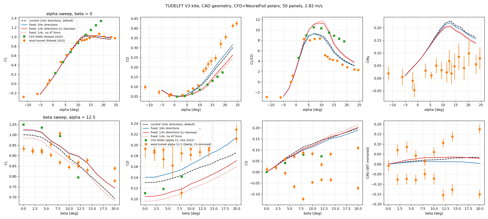

# Solver Module Documentation

## Overview

The `Solver` class implements iterative algorithms to determine the circulation distribution over a wing that satisfies the boundary conditions of the aerodynamic model. It supports both VSM (Vortex Step Method) and LLT (Lifting Line Theory) approaches with various convergence strategies and stall modeling capabilities.

## Class: Solver

### Constructor

```python
Solver(
    aerodynamic_model_type="VSM",
    max_iterations=5000,
    allowed_error=1e-6,
    relaxation_factor=None,
    core_radius_fraction=1e-20,
    gamma_loop_type="base",
    gamma_initial_distribution_type="elliptical",
    is_only_f_and_gamma_output=False,
    is_with_viscous_drag_correction=False,
    reference_point=[0, 0, 0],
    mu=1.81e-5,
    rho=1.225,
    # Stall modeling parameters...
)
```

## Core Parameters

### Aerodynamic Model Configuration
- **`aerodynamic_model_type`** (str): "VSM" or "LLT" (default: "VSM")
- **`core_radius_fraction`** (float): Vortex core radius fraction (default: 1e-20)

### Convergence Control
- **`max_iterations`** (int): Maximum solver iterations (default: 5000)
- **`allowed_error`** (float): Convergence tolerance (default: 1e-6) 
- **`relaxation_factor`** (float | None): Under-relaxation factor of the
  fixed-point loops. Default None: 0.8 x the stability limit of Li, Gaunaa,
  Pirrung & Lønbæk (TORQUE 2026, Eq. 11), `omega_max = 2 / (1 + 1/4 max_i
  (c_i/dz_i) Cl'_i)`, evaluated per solve on the actual panels and polars
  (`Solver.compute_relaxation_factor_limit()`); the value used is stored in
  `solver.relaxation_factor_used`. The bound is exact for LLT (quarter-chord
  evaluation) and is halved for VSM, whose 3/4-chord control point sees about
  twice the trailing-vortex induction (measured ratio 0.5-0.66). On the V3
  kite with 50 panels this gives 0.026 (VSM) and converges in about half the
  iterations of the old fixed 0.01; explicit values are used verbatim.

### Initial Conditions
- **`gamma_initial_distribution_type`** (str): Initial circulation distribution
  - `"elliptical"`: Elliptical wing theoretical distribution
  - `"cosine"`: Cosine-based distribution  
  - `"zero"`: Zero initial circulation
  - `"previous"`: Use provided distribution

### Solution Methods
- **`gamma_loop_type`** (str): Iterative algorithm type
  - `"base"`: Standard fixed-point iteration with relaxation
  - `"anderson"`: Anderson-accelerated relaxed fixed point (same fixed point,
    ~10-25x fewer iterations in attached flow; can limit-cycle post-stall)
  - `"casadi_newton"`: Newton on the circulation residual with an exact
    CasADi Jacobian, globalised by pseudo-transient continuation. Same fixed
    point as `base`; 3-10 iterations in attached flow (~100x fewer than
    `base`), 5-10x faster wall clock per solve, converges post-stall where
    `base`/`anderson` stall. Needs the optional `casadi` dependency
    (`pip install Vortex-Step-Method[casadi]`). Knobs: `newton_max_iterations`
    (200), `newton_pseudo_time_step` (0.03, the floor/restart pseudo step),
    `newton_fallback_to_base` (True). NOTE its stopping rule is the UN-relaxed
    residual `max|G(gamma) - gamma| / max|gamma| < allowed_error`, which is
    `1/relaxation_factor` tighter than the base/anderson rule at the same
    `allowed_error`.
  - `"non_linear"`: Robust nonlinear solvers (Broyden methods)

## Primary Method: solve()

### `solve(body_aero, gamma_distribution=None)`

Main solution method that computes circulation distribution and aerodynamic forces.

**Parameters:**
- `body_aero` (BodyAerodynamics): Configured aerodynamic model
- `gamma_distribution` (np.ndarray): Initial circulation guess (optional)

**Returns:**
- `dict`: Comprehensive results dictionary with forces, moments, and distributions

### Solution Process

#### 1. Initialization
```python
# Extract panel properties
for i, panel in enumerate(body_aero.panels):
    x_airf_array[i] = panel.x_airf
    y_airf_array[i] = panel.y_airf
    va_array[i] = panel.va
    chord_array[i] = panel.chord
    # ...
```

#### 2. AIC Matrix Computation
```python
AIC_x, AIC_y, AIC_z = body_aero.compute_AIC_matrices(
    aerodynamic_model_type,
    core_radius_fraction, 
    va_norm_array,
    va_unit_array
)
```

#### 3. Initial Circulation Distribution
```python
if gamma_initial_distribution_type == "elliptical":
    gamma_initial = body_aero.compute_circulation_distribution_elliptical_wing()
elif gamma_initial_distribution_type == "cosine":
    gamma_initial = body_aero.compute_circulation_distribution_cosine()
# ...
```

#### 4. Iterative Solution
```python
converged, gamma_new, alpha_array, Umag_array = self.gamma_loop(gamma_initial)

# Retry with reduced relaxation if not converged
if not converged:
    converged, gamma_new, alpha_array, Umag_array = self.gamma_loop(
        gamma_initial, extra_relaxation_factor=0.5
    )
```

#### 5. Results Computation
```python
results = body_aero.compute_results(
    gamma_new, rho, aerodynamic_model_type, core_radius_fraction,
    mu, alpha_array, Umag_array, chord_array, x_airf_array, y_airf_array,
    z_airf_array, va_array, va_norm_array, va_unit_array, panels,
    is_only_f_and_gamma_output, is_with_viscous_drag_correction, reference_point
)
```

## Iterative Solution Methods

### `gamma_loop(gamma_initial, extra_relaxation_factor=1.0)`

Standard fixed-point iteration with under-relaxation.

**Algorithm:**
```python
for iteration in range(max_iterations):
    # 1. Compute aerodynamic quantities from current gamma
    alpha_array, Umag_array, cl_array = compute_aerodynamic_quantities(gamma)
    
    # 2. Update circulation using Kutta-Joukowski with the inner velocity
    #    (Gaunaa, Li & Pirrung, TORQUE 2026, Eq. 4): Gamma = 0.5 |V_inner| c Cl
    gamma_new = 0.5 * Umag_array * cl_array * chord_array
    
    # 3. Apply under-relaxation
    gamma_new = (1 - relaxation_factor) * gamma + relaxation_factor * gamma_new
    
    # 4. Check convergence
    normalized_error = max(|gamma_new - gamma|) / max(|gamma_new|)
    if normalized_error < allowed_error:
        converged = True
        break
```

**Convergence Features:**
- Normalized error computation
- Oscillation detection and damping
- Adaptive relaxation for stability

### `gamma_loop_non_linear(gamma_initial)`

Robust nonlinear solver using SciPy optimization methods.

**Formulation:**
Solves F(γ) = γ - γ_new(γ) = 0 where γ_new(γ) is computed from:
```python
def compute_gamma_residual(gamma):
    _, Umag_array, cl_array = compute_aerodynamic_quantities(gamma)
    gamma_new = 0.5 * Umag_array * cl_array * chord_array
    return gamma - gamma_new  # Residual
```

**Methods Attempted:**
1. **Broyden1**: Quasi-Newton method with rank-1 updates
2. **Broyden2**: Quasi-Newton method with rank-2 updates  
3. **Fallback**: Standard gamma_loop if nonlinear methods fail

**Advantages:**
- Superior convergence for difficult cases
- Automatic step size adaptation
- Robust handling of stiff problems

## Aerodynamic Quantity Computation

### `compute_aerodynamic_quantities(gamma)`

Computes flow variables from circulation distribution.

**Process:**
```python
# 1. Induced velocities from AIC matrices
induced_velocity = [AIC_x @ gamma, AIC_y @ gamma, AIC_z @ gamma].T

# 2. Relative velocity (apparent + induced)
relative_velocity = va_array + induced_velocity

# 3. Local angle of attack
v_normal = sum(x_airf_array * relative_velocity, axis=1)
v_tangential = sum(y_airf_array * relative_velocity, axis=1)  
alpha_array = arctan(v_normal / v_tangential)

# 4. Effective velocity magnitude
relative_velocity_crossz = cross(relative_velocity, z_airf_array)
Umag_array = norm(relative_velocity_crossz, axis=1)

# 5. Lift coefficients from polar data
cl_array = [panel.compute_cl(alpha) for panel, alpha in zip(panels, alpha_array)]
```

**Returns:**
- `alpha_array`: Effective angles of attack
- `Umag_array`: Span-perpendicular inner velocity magnitudes `|v_eff x z_airf|`
- `cl_array`: Lift coefficients

## Advanced Features

### Stall Modeling

**`is_with_artificial_viscosity`** (default False) with **`artificial_viscosity_factor`**
(0.035): the spanwise artificial viscosity of Li, Gaunaa, Pirrung & Lønbæk
(TORQUE 2026), applied implicitly to the fixed-point target once any panel is
past its positive or negative stall onset. Parameter free; the coefficient
`mu_i = max(0, -k S Cl'_i / dz_i^2)` is the paper's Eq. 16 written for a
non-uniform grid (the paper derives it for uniform rectangular wings).

### Consistent lifting-line coupling (Gaunaa, Li & Pirrung, TORQUE 2026)

- Panel frames are orthonormal and built on the bound-vortex axis; the chord
  and the airfoil plane are taken perpendicular to the local span (CP1).
- Force magnitudes use the 3/4-chord angle of attack (TAT2); with
  **`is_aoa_corrected=True`** the lift and drag directions come from the flow
  at the quarter chord (TAT3, the paper's LL-Gaunaa). The default False keeps
  the 3/4-chord directions (the paper's LL-3/4, which underestimates induced
  drag).
- **`is_with_attached_trailed_vortex_force`** (default True): Kutta-Joukowski
  force on the chordwise vortex legs between the bound vortex and the trailing
  edge (Sec. 3 of the paper). Zero net effect on unswept wings, needed for swept
  ones. Reported per section boundary in `F_attached_trailed_distribution` and
  folded into `F_distribution` and the totals.

Every solve of a wing in one uniform inflow also reports
`results["drag_induced_trefftz"]`, the Trefftz-plane induced drag
(`BodyAerodynamics.compute_trefftz_plane_induced_drag`): the far-wake value
that does not depend on where the forces are evaluated on the blade. With
quarter-chord directions and the attached-trailed force the on-blade drag of
an inviscid straight wing matches it to four digits; with 3/4-chord
directions it does not. It is `None` for per-panel inflow or body rates.

Effect on the TUDELFT V3 kite polars (CAD geometry, CFD+NeuralFoil polars,
50 panels) against RANS and wind-tunnel data: the dashed line is the solver
before these changes, the blue line the consistent implementation with 3/4-
chord directions, the red line with quarter-chord directions
(`is_aoa_corrected=True`), dotted without the attached-trailed force.



More figures (frame, Trefftz check, attached-trailed force, relaxation,
wake direction) with their descriptions are in [figures/README.md](figures/README.md).

### Frozen wake direction

Each ring's two semi-infinite wake filaments follow that panel's own apparent
velocity (freestream plus the body-rate term, or the distributed inflow). In a
uniform inflow this is the classical single straight wake along the freestream,
so translating-flight results are unchanged; under yaw or roll rates the wake
is now locally aligned instead of following one mean direction taken before
the rotational term. The wake direction is a second-order effect for a
translating wing (a per-panel local-flow wake changes the V3 lift by under 1%).

### Viscous Drag Correction

**`is_with_viscous_drag_correction`** (default False): the spanwise-flow
correction of the friction force from Gaunaa, Sørensen & Li (2024), Eqs. 10 and
11: a drag increment along the local inner flow and a spanwise friction force,
both driven by the angle between the full relative velocity at the control
point and the span-normal plane.

### Output Options

- **`is_only_f_and_gamma_output`**: Return only forces and circulation (fast mode)
- **`reference_point`**: Moment reference point for results

## Error Handling and Robustness

### Convergence Monitoring
```python
# Normalized error tracking
reference_error = max(abs(gamma_new)) if max(abs(gamma_new)) != 0 else 1e-4
normalized_error = max(abs(gamma_new - gamma)) / reference_error

# Oscillation detection
if error_history[-1] > error_history[-2] and error_history[-2] < error_history[-3]:
    # Apply additional damping
    gamma_new = 0.75 * gamma_new + 0.25 * gamma
```

### Adaptive Strategies
- Automatic relaxation factor reduction
- Method switching (linear → nonlinear)
- Graceful degradation for difficult cases

### Validation Checks
- Physical bounds on circulation values
- Angle of attack range validation
- Velocity magnitude sanity checks

## Performance Optimization

### Computational Efficiency
- JIT-compiled vector operations
- Efficient AIC matrix operations
- Minimal memory allocation in loops

### Memory Management
- Pre-allocated arrays for panel properties
- In-place updates where possible
- Efficient sparse matrix operations

### Scalability
- O(N²) AIC matrix computation (once per solution)
- O(N) per iteration for gamma updates
- Suitable for wings with 100+ panels

## Integration Examples

### Basic Usage
```python
# Create solver
solver = Solver(
    aerodynamic_model_type="VSM",
    max_iterations=2000,
    allowed_error=1e-5,
    relaxation_factor=0.02
)

# Solve aerodynamics
results = solver.solve(body_aero)

# Access results
cl = results['cl']
cd = results['cd'] 
gamma_dist = results['gamma_distribution']
```

### Advanced Configuration
```python
# Fast, robust circulation solve (exact-Jacobian Newton; needs casadi)
solver = Solver(
    gamma_loop_type="casadi_newton",
    allowed_error=1e-8,
    is_with_artificial_viscosity=True,
)

# High-accuracy nonlinear solver
solver = Solver(
    aerodynamic_model_type="VSM",
    gamma_loop_type="non_linear",
    allowed_error=1e-8,
    is_with_viscous_drag_correction=True,
    reference_point=[0.5, 0.0, 0.0]
)

# Post-stall regularization (Li et al. 2026) and quarter-chord force directions
stall_solver = Solver(
    is_with_artificial_viscosity=True,
    is_aoa_corrected=True,
)
```

### Parameter Studies
```python
# Convergence study
solvers = [
    Solver(allowed_error=1e-4),
    Solver(allowed_error=1e-5),  
    Solver(allowed_error=1e-6)
]

results = [solver.solve(body_aero) for solver in solvers]
```

## Troubleshooting

### Common Convergence Issues
1. **Oscillating solutions**: Reduce relaxation_factor
2. **Slow convergence**: Use `gamma_loop_type="casadi_newton"` (or `"anderson"`)
3. **Divergence**: Check flow conditions and geometry

### Performance Issues  
1. **Slow iterations**: Reduce max_iterations for initial studies
2. **Memory usage**: Use is_only_f_and_gamma_output=True
3. **Accuracy vs speed**: Balance allowed_error vs computation time

### Physical Validity
1. **Negative lift**: Check angle of attack and airfoil data
2. **Excessive circulation**: Verify geometry and flow conditions
3. **Stall behavior**: Enable appropriate stall modeling
